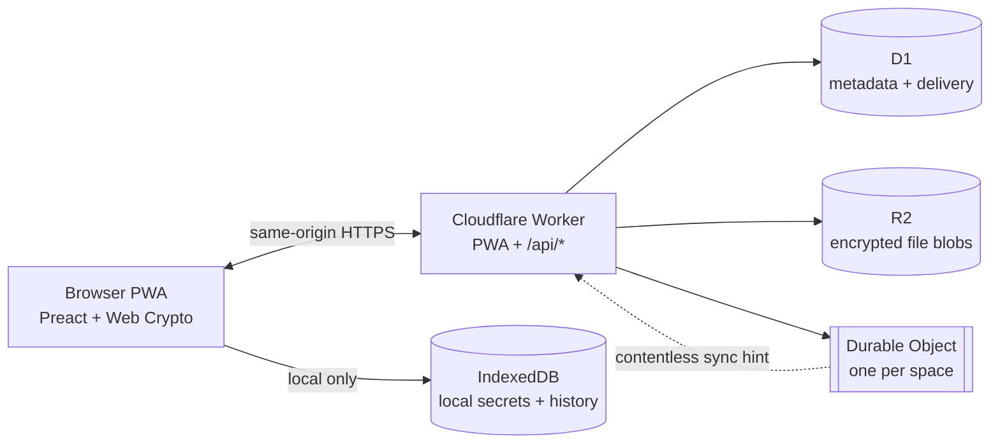

# Architecture

This is the current architecture of the repository. The server is a relay and mailbox for encrypted data; the browser is the component that owns plaintext, private keys, and the space keys.

## Runtime topology

The browser reaches the Durable Object through `GET /api/realtime`; it does not access the object directly. The Worker authenticates the device, routes the socket to the object for its space, and keeps D1 as the source of truth.

## Repository components

| Component | Responsibility |
| --- | --- |
| `apps/web` | Preact UI, Web Crypto operations, IndexedDB persistence, service worker, background outbox, and real-time client. |
| `apps/worker` | Cloudflare Worker entry point, routing, authentication, API handlers, D1 queries, R2 streaming, cleanup cron, and Durable Object integration. |
| `packages/shared` | DTOs, constants, device roles, pending-message shapes, and the exact bytes covered by signatures. |
| `e2e` | Playwright tests that exercise the built PWA in a real browser across page and browser restarts. |
| `scripts` | Deployment migration guard and an end-to-end protocol verification helper. |

## Data flow

### Creating a space

1. The first device creates a random space id, a random per-device bearer token, an ECDH key pair, a signing key pair, and the first `GroupKey` locally.
2. It sends the space id, a SHA-256 hash of the bearer token, public keys, and an encrypted device name to `POST /api/groups`.
3. The Worker stores the device and metadata in D1. The raw token, private keys, and `GroupKey` remain in the browser.

### Pairing another device

1. The joining device generates its identity and reserves a short-lived pairing slot with its public keys.
2. The existing device reads the joining device's QR/text payload out of band, verifies that the keys match the slot, and encrypts a pairing package for the joining device.
3. The package contains the joining device's bearer token, the current `GroupKey`, and the key epoch. When the introducer has a signing identity, it also carries the introducer's verified roster. The Worker stores only the wrapped package.
4. The joining device polls the slot, unwraps the package locally, and persists its own session and keys.

### Sending and receiving

1. The sender encrypts text, file contents, and the metadata envelope locally with the current `GroupKey`.
2. An encrypted file is uploaded to R2 first. The message metadata and per-device pending delivery rows are then written to D1.
3. The Worker sends a best-effort notification to the space's Durable Object. The object broadcasts only `{ "type": "sync" }` to other connected devices.
4. Each recipient performs the normal authenticated pending-message sync, downloads and decrypts any file, stores the result locally, and acknowledges the message.
5. When every active recipient has acknowledged, the Worker deletes the message row and its R2 object. An hourly cron job is the safety net for content older than 24 hours.

### Albums and captions

A message can carry text and a file at once, which is what a caption is. A selection of several files still becomes one message per file: they share a batch id inside the encrypted metadata envelope, and the receiving chat renders the run as a single bubble under a single caption. The grouping is presentational on purpose — on the wire each file keeps its own delivery row and its own upload, which is the only granularity a background pass cut short can resume from.

### Temporary (view-once) messages

A message can be marked `viewOnce` inside the same encrypted envelope. The first device to open one queues a global-delete tombstone before showing the content, so the other devices lose it from the moment it is opened, and drops its own copy when the reader closes it. This is cooperative, exactly like deleting for everyone: it is a UI affordance, not a guarantee against a screenshot or a modified client.

### Deleting for everyone

The client sends a signed tombstone through the same message and delivery pipeline. The Worker immediately removes the server-side target and its file, then recipients validate the tombstone and remove their local copy. This is cooperative deletion, not a remote wipe; a recipient that is modified, offline forever, or has already copied a file elsewhere can retain it.

## Storage responsibilities

| Store | Holds | Lifecycle |
| --- | --- | --- |
| D1 | Space and device records, public keys, token hashes, encrypted message metadata, delivery state, pairing slots, and wrapped rotated keys. | Pairing slots expire after 10 minutes. Message records are removed after full delivery or by the 24-hour cleanup. |
| R2 | Encrypted file blobs only. | Removed after the message is fully delivered, when its message is deleted, or by cleanup after 24 hours. The bucket should also have a one-day lifecycle rule. |
| Durable Object | Connected WebSockets for one space. | No application state is stored. Hibernation allows idle spaces to cost nothing beyond their other resources. |
| IndexedDB | Device sessions, private key material, GroupKey epochs, local message history, and cached file content. | Persists until the user removes it. There is currently no automatic local history-retention policy. |
| Cache Storage | A short-lived cleartext hand-off for browser share-target files before the app consumes them. | The namespace is bounded and cleared around consumption; see the open decision in [AUDIT.md](../AUDIT.md). |

## Documents served

The site is built from two templates, and which document a URL is served decides what the browser paints before any application code has run.

| URL | Document | Prerendered content |
| --- | --- | --- |
| `/` | `dist/index.html` | The marketing page, so crawlers and no-JS clients get real HTML. |
| `/app`, `/app/<id>`, `/app/<id>/devices` | `dist/app.html` | The app's own loading screen. |
| `/security/`, `/privacy/` | `dist/<page>/index.html` | The security model and the privacy policy. |
| Any unknown URL | `dist/404.html` | The not-found page. |

The first two come from `apps/web/index.html` and load the app. The static pages come from `apps/web/page.html`, which loads the site's styles and a small script that applies the appearance chosen in the app, but not the app itself; they are never hydrated. Every page of the public site, the landing page included, is rendered from the components in `apps/web/src/site`, so they share one header, footer and design system, and the limits they quote (file size, retention, pairing lifetime) are read from the constants that enforce them.

Everything comes out of the client build (`apps/web/scripts/prerender.mjs`, run before the service worker's precache manifest is globbed) and is served by the Worker and, offline, by the service worker's precache. In development, `apps/web/scripts/dev-static-pages.mjs` renders the static pages on request from the same components and template. Serving the marketing document for `/app` is what made the installed app flash the landing page at every launch: the shell paints long before the bundle can replace it.

The Worker permanently redirects the retired `/how-it-works/` and `/install/` pages to the landing page sections that replaced them.

## Delivery guarantees

The Durable Object is an acceleration path, not a delivery system. A dropped WebSocket notification, a frozen tab, or a proxy that kills the connection can delay synchronization, but pending rows in D1 remain the source of truth. Normal polling runs every 8 seconds; while a real-time connection is healthy, the client keeps a 60-second safety-net poll.

## Design invariants

- The Worker never needs an unwrapped `GroupKey`.
- D1 is the only source of truth for pending delivery and cleanup state.
- A Durable Object does not store ciphertext or delivery bookkeeping.
- Device bearer tokens are independent, so revoking one device does not sign out the others.
- The API rejects messages encrypted under a superseded key epoch.
- The shared TypeScript package is the contract between the Worker and the PWA.
